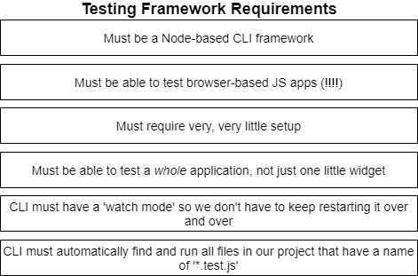

# About this project "Test Me" (TME)

## Requirements

Test me is a Testframework which fullfills following requirements:

## How does it work

It uses a Breadth First Search algorithm to collect all the folders within the current working directory to iterate through them.

## Installation
1. Download
2. run `NPM link` in the downloaded folder

## Run a test

You can run a test by simply running `tme` in the working Directory of your project you want to test.
`tme` will automatically iterate over all you project structure and looks for `.test.js`-files to run them.